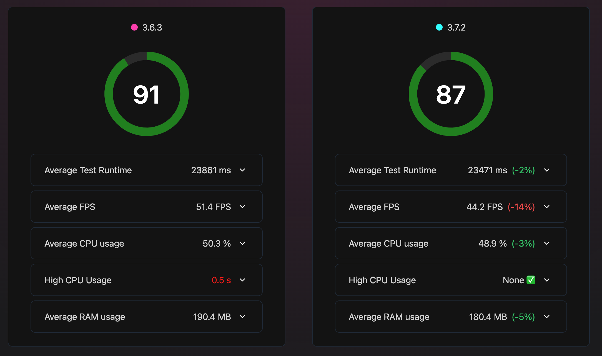
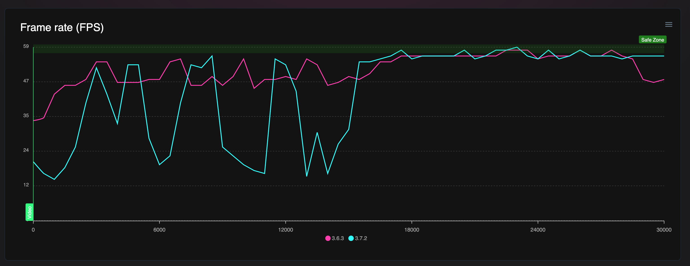

# Perf degradation between reanimated 3.6.3 and 3.7.2

To run the benchmark:

1. Install the dependencies: `npm install`
2. Install Flashlight: https://docs.flashlight.dev/
3. Install Maestro: https://maestro.mobile.dev/getting-started/installing-maestro

## To run for for reanimated 3.6.3

1. `npm install react-native-reanimated@3.6.3`
2. `npm run android:release`
3. ```flashlight test --bundleId com.anonymous.reanimatedperfissue \
   --testCommand "maestro test scroll.yml" \
   --duration 30000 \
   --iterationCount 5 \
   --resultsFilePath 3_6_3.json --resultsTitle "3.6.3"
   ```

## To run for for reanimated 3.7.2

1. `npm install react-native-reanimated@3.7.2`
2. `npm run android:release`
3. ```flashlight test --bundleId com.anonymous.reanimatedperfissue \
   --testCommand "maestro test scroll.yml" \
   --duration 30000 \
   --iterationCount 5 \
   --resultsFilePath 3_7_2.json --resultsTitle "3.7.2"
   ```

## Results

The included results have been run on a Samsung Galaxy A52G

`flashlight report 3_6_3.json 3_7_2.json`




